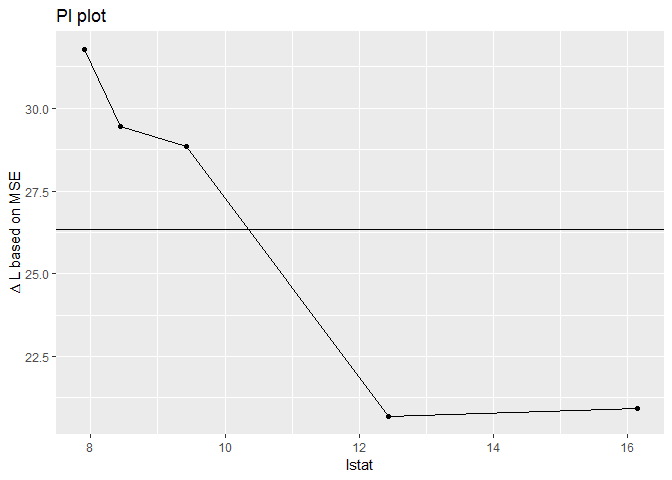
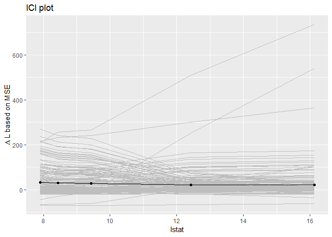

# featureImportance: Model-agnostic permutation feature importance with the [`mlr`](https://github.com/mlr-org/mlr) package

[](http://cran.r-project.org/web/packages/featureImportance)
[](http://cran.rstudio.com/web/packages/featureImportance/index.html)
[](https://travis-ci.org/giuseppec/featureImportance)
[](https://codecov.io/gh/giuseppec/featureImportance)

## Results of the article [“Visualizing the Feature Importance for Black Box Models”](https://arxiv.org/abs/1804.06620)

This R package was developed as a part of the article [“Visualizing the
Feature Importance for Black Box
Models”](https://arxiv.org/abs/1804.06620) accepted at the ECML-PKDD
2018 conference track. The results of the application section of this
article can be reproduced with the code provided
[here](https://github.com/giuseppec/featureImportance/blob/master/ecml-demo/application_results.md).

## Installation of the package

Install the development version from GitHub (using `devtools`)

``` r
install.packages("devtools")
devtools::install_github("giuseppec/featureImportance")
```

## Introduction

The `featureImportance` package is an extension for the
[`mlr`](https://github.com/mlr-org/mlr) package and allows to compute
the permutation feature importance in a model-agnostic manner. The focus
is on performance-based feature importance measures:

  - **Model reliance** and **algorithm reliance**, which is a
    model-agnostic version of [breiman’s permutation
    importance](https://www.stat.berkeley.edu/~breiman/randomforest2001.pdf)
    introduced in the article
    [arXiv:1801.01489v3](https://arxiv.org/abs/1801.01489).
  - **SFIMP** (Shapley Feature Importance)
  - PIMP

## Use case: Compute importance based on test data

This use case computes the feature importance of a model based on a
single test data set.

``` r
library(mlr)
library(mlbench)
library(featureImportance)
set.seed(2018)

# Get boston housing data and look at the data
data(BostonHousing, package = "mlbench")
str(BostonHousing)
```

    ## 'data.frame':    506 obs. of  14 variables:
    ##  $ crim   : num  0.00632 0.02731 0.02729 0.03237 0.06905 ...
    ##  $ zn     : num  18 0 0 0 0 0 12.5 12.5 12.5 12.5 ...
    ##  $ indus  : num  2.31 7.07 7.07 2.18 2.18 2.18 7.87 7.87 7.87 7.87 ...
    ##  $ chas   : Factor w/ 2 levels "0","1": 1 1 1 1 1 1 1 1 1 1 ...
    ##  $ nox    : num  0.538 0.469 0.469 0.458 0.458 0.458 0.524 0.524 0.524 0.524 ...
    ##  $ rm     : num  6.58 6.42 7.18 7 7.15 ...
    ##  $ age    : num  65.2 78.9 61.1 45.8 54.2 58.7 66.6 96.1 100 85.9 ...
    ##  $ dis    : num  4.09 4.97 4.97 6.06 6.06 ...
    ##  $ rad    : num  1 2 2 3 3 3 5 5 5 5 ...
    ##  $ tax    : num  296 242 242 222 222 222 311 311 311 311 ...
    ##  $ ptratio: num  15.3 17.8 17.8 18.7 18.7 18.7 15.2 15.2 15.2 15.2 ...
    ##  $ b      : num  397 397 393 395 397 ...
    ##  $ lstat  : num  4.98 9.14 4.03 2.94 5.33 ...
    ##  $ medv   : num  24 21.6 34.7 33.4 36.2 28.7 22.9 27.1 16.5 18.9 ...

``` r
# Create regression task for mlr
boston.task = makeRegrTask(data = BostonHousing, target = "medv")
boston.task
```

    ## Supervised task: BostonHousing
    ## Type: regr
    ## Target: medv
    ## Observations: 506
    ## Features:
    ##    numerics     factors     ordered functionals 
    ##          12           1           0           0 
    ## Missings: FALSE
    ## Has weights: FALSE
    ## Has blocking: FALSE
    ## Has coordinates: FALSE

``` r
# Specify the machine learning algorithm with the mlr package
lrn = makeLearner("regr.randomForest", ntree = 100)

# Create indices for train and test data
n = getTaskSize(boston.task)
train.ind = sample(n, size = 0.6*n)
test.ind = setdiff(1:n, train.ind)

# Fit model on train data
mod = train(lrn, boston.task, subset = train.ind)

# Use feature values of randomly chosen observations from test data to plot the importance curves
test = getTaskData(boston.task, subset = test.ind)
obs.id = sample(1:nrow(test), 5)

# Measure feature importance on test data
imp = featureImportance(mod, data = test, replace.ids = obs.id, local = TRUE)
summary(imp)
```

    ##     features         mse
    ##  1:    lstat 26.33521188
    ##  2:       rm 20.19416617
    ##  3:      dis  3.93376158
    ##  4:     crim  3.61006537
    ##  5:  ptratio  2.93144168
    ##  6:    indus  2.38899017
    ##  7:      nox  2.16394450
    ##  8:      tax  1.30857793
    ##  9:      age  0.95716756
    ## 10:        b  0.61523373
    ## 11:      rad  0.26533228
    ## 12:       zn  0.07362979
    ## 13:     chas  0.04761391

``` r
# Plot PI curve
plotImportance(imp, feat = "lstat", mid = "mse", individual = FALSE, hline = TRUE)
```

<!-- -->

``` r
# Plot ICI curves
plotImportance(imp, feat = "lstat", mid = "mse", individual = TRUE, hline = FALSE)
```

<!-- -->

## Use case: Compute importance using a resampling technique

Instead of computing the feature importance of a model by using a single
test data set, one can repeat this process by embedding the feature
importance calculation within a resampling procedure. The resampling
procedure creates multiple models using different training sets, and the
corresponding test sets can be used to calculate the feature importance.
For example, using 5-fold cross-validation results in 5 different
models, one for each cross-validation fold.

``` r
rdesc = makeResampleDesc("CV", iter = 5)
res = resample(lrn, boston.task, resampling = rdesc, models = TRUE)
imp = featureImportance(res, data = getTaskData(boston.task), n.feat.perm = 10)
summary(imp)
```

    ##     features        mse
    ##  1:    lstat 37.3600311
    ##  2:       rm 24.9654495
    ##  3:      nox  4.6920257
    ##  4:      dis  2.9417279
    ##  5:  ptratio  2.6563632
    ##  6:     crim  2.4440099
    ##  7:    indus  1.6214079
    ##  8:      tax  1.5573068
    ##  9:      age  0.8769893
    ## 10:        b  0.8000723
    ## 11:      rad  0.2938185
    ## 12:       zn  0.1397263
    ## 13:     chas  0.0530677
